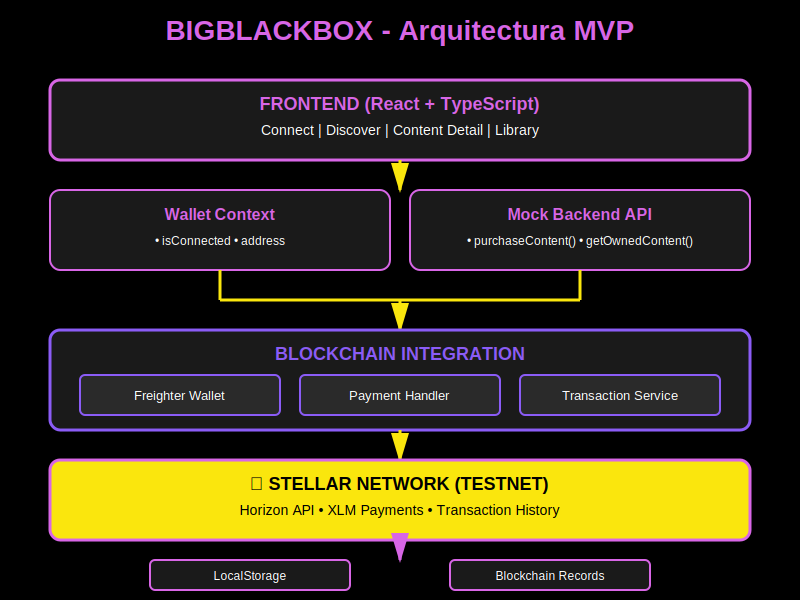
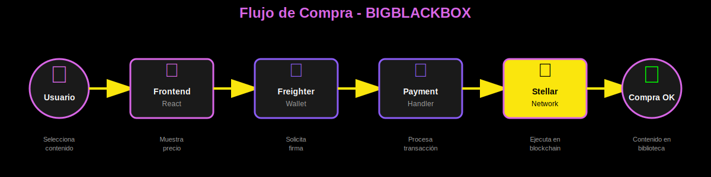

# 📊 Diagramas de Arquitectura - BIGBLACKBOX

He generado **3 tipos de diagramas** para tu presentación al jurado:

---

## 📁 Archivos Generados

### 1. `architecture-diagram.md` 
**Diagramas Mermaid interactivos**
- ✅ Se renderizan automáticamente en GitHub/GitLab
- ✅ Incluye 5 variantes diferentes
- ✅ Código copiable para Mermaid Live Editor

**Contiene:**
- Diagrama vertical completo
- Diagrama horizontal simplificado
- Secuencia de flujo de compra
- Capas de arquitectura
- Mindmap del tech stack

### 2. `architecture-simple.svg`
**Diagrama vertical en capas**
- ✅ Imagen lista para usar
- ✅ Colores del brand (Purple #D866E6, Yellow #FAE60D)
- ✅ Muestra las 5 capas de la arquitectura

**Dimensiones:** 800x600px

### 3. `flow-diagram.svg`
**Flujo horizontal de compra**
- ✅ Imagen lista para usar
- ✅ Perfecto para presentaciones
- ✅ Muestra el journey del usuario paso a paso

**Dimensiones:** 1200x300px

---

## 🎯 Cómo Usar los Diagramas

### Para GitHub README
```markdown
# Opción 1: Mermaid (se renderiza automáticamente)
Copia el contenido de architecture-diagram.md directamente en tu README.md

# Opción 2: SVG embebido


```

### Para Presentaciones (PowerPoint/Google Slides)
1. Abre `architecture-simple.svg` o `flow-diagram.svg` en tu navegador
2. Click derecho → "Guardar imagen como PNG"
3. Inserta en tu presentación

**O mejor aún:**
- Los archivos SVG se pueden insertar directamente en PowerPoint/Google Slides
- Mantienen calidad perfecta en cualquier tamaño

### Para Documentación Online
Los SVG se pueden usar directamente en:
- Notion (arrastra y suelta)
- Confluence (insertar imagen)
- GitBook (markdown)
- Cualquier editor web

### Para Editar los Diagramas

#### Mermaid (architecture-diagram.md)
1. Ve a https://mermaid.live
2. Copia el código del diagrama que quieras
3. Edita en tiempo real
4. Exporta como PNG/SVG/PDF

#### SVG (architecture-simple.svg, flow-diagram.svg)
1. Abre con cualquier editor de texto
2. Modifica colores, textos, posiciones
3. Visualiza en navegador para ver cambios
4. O usa herramientas como:
   - Figma (importar SVG)
   - Inkscape (editor SVG gratuito)
   - Adobe Illustrator

---

## 🎨 Paleta de Colores Usada

```
Background:     #000000 (Negro puro)
Primary:        #D866E6 (Purple)
Accent:         #FAE60D (Yellow)
Secondary:      #8B5CF6 (Purple claro)
Text:           #FFFFFF (Blanco)
Text Secondary: #A0A0A0 (Gris)
```

---

## 📋 Diagramas Recomendados por Contexto

### Para el Pitch Inicial (2-3 min)
✅ **Usa:** `flow-diagram.svg`
- Muestra el flujo completo en una sola línea
- Fácil de entender rápidamente
- Perfecto para explicar el valor

### Para Explicación Técnica (5-10 min)
✅ **Usa:** `architecture-simple.svg`
- Muestra todas las capas
- Detalla componentes implementados
- Demuestra conocimiento técnico

### Para Documentación Técnica
✅ **Usa:** Diagramas Mermaid de `architecture-diagram.md`
- Interactivos en GitHub
- Fáciles de actualizar
- Múltiples vistas disponibles

### Para Demo en Vivo
✅ **Usa:** Secuencia Mermaid (sequence diagram)
- Muestra interacción paso a paso
- Sincroniza con tu demo
- Visualiza el flujo de datos

---

## 🚀 Próximos Pasos

1. **Revisa los diagramas** - Abre los SVG en tu navegador
2. **Elige el mejor para tu pitch** - Según el tiempo disponible
3. **Inserta en tu presentación** - PowerPoint/Google Slides
4. **Actualiza el README.md** - Agrega los diagramas Mermaid

---

## 💡 Tips para la Presentación

### ✅ DO
- Usa el diagrama de flujo para explicar el journey del usuario
- Destaca la integración con Stellar (capa amarilla)
- Menciona que está funcionando en Testnet
- Muestra los componentes implementados (✅) vs planificados (⏳)

### ❌ DON'T
- No uses todos los diagramas a la vez (sobrecarga visual)
- No entres en detalles técnicos si el jurado no es técnico
- No menciones "mock" sin aclarar que es temporal

---

## 📞 Soporte

Si necesitas modificar algún diagrama:
1. Dime qué cambiar
2. Te genero la versión actualizada
3. O te doy el código para que lo edites tú

---

**Creado para:** BBB Team - Hackathon Stellar  
**Fecha:** Noviembre 2025  
**Colores:** Brand BIGBLACKBOX
