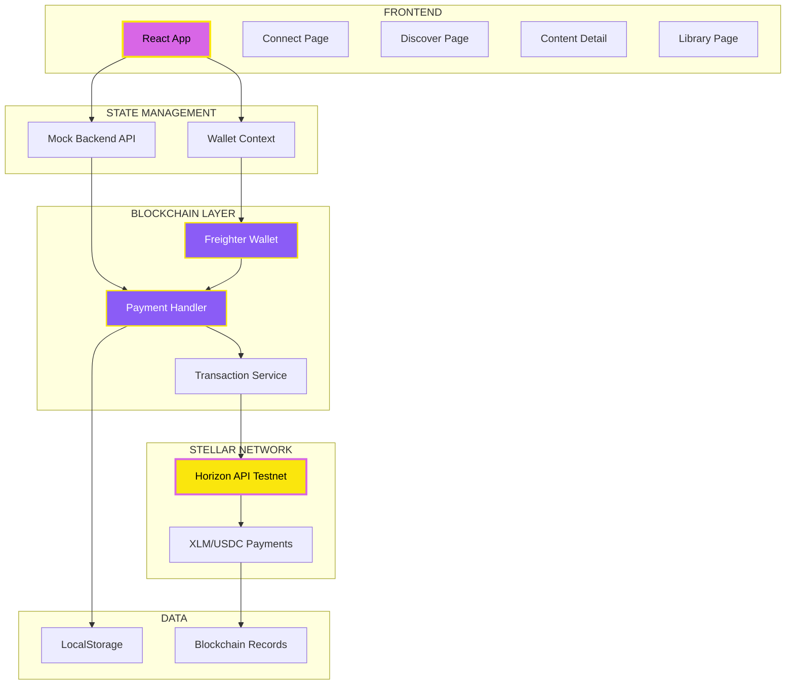
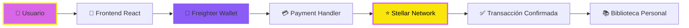
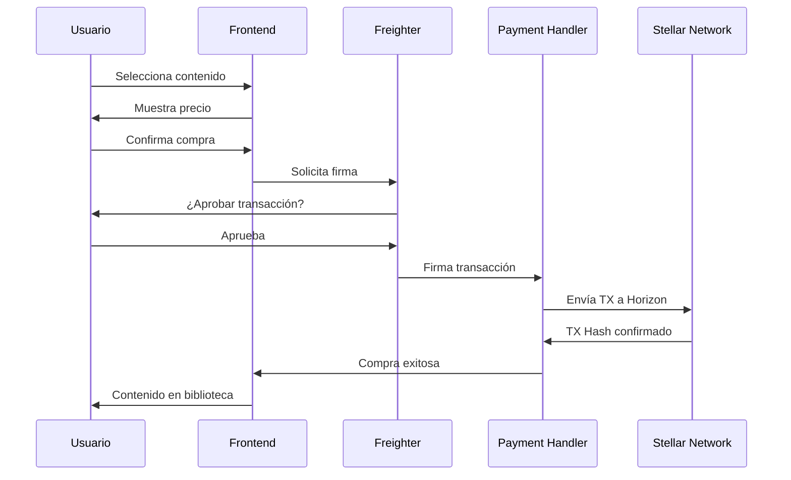
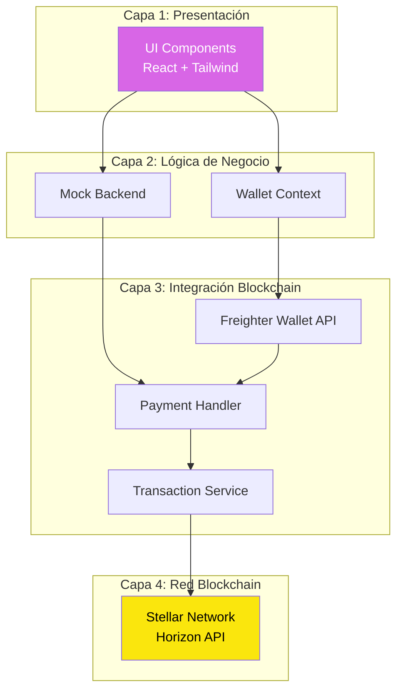
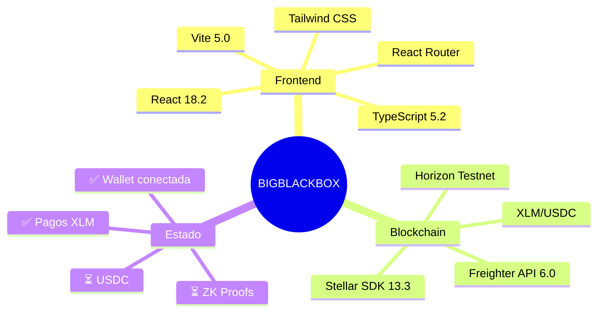

# Diagrama de Arquitectura BIGBLACKBOX

## Versión Simplificada (Mermaid)



## Versión Horizontal Simplificada



## Flujo de Compra Simplificado



## Capas de la Arquitectura



## Stack Tecnológico Visual



---

## Cómo usar estos diagramas

### Para GitHub/GitLab
Los diagramas Mermaid se renderizan automáticamente en:
- GitHub README.md
- GitLab README.md
- Notion
- Obsidian

### Para presentaciones
1. **Copiar a Mermaid Live Editor**: https://mermaid.live
2. **Exportar como PNG/SVG**
3. **Usar en PowerPoint/Google Slides**

### Para documentación
Puedes insertar estos bloques directamente en tu README.md y se renderizarán automáticamente en plataformas compatibles.

---

## Versión ASCII Art (Para terminales/texto plano)

```
┌─────────────┐
│   USUARIO   │
└──────┬──────┘
       │
       ▼
┌─────────────────────────┐
│   FRONTEND (React)      │
│  - Connect Page         │
│  - Discover Page        │
│  - Library Page         │
└──────────┬──────────────┘
           │
           ▼
┌─────────────────────────┐
│  WALLET MANAGEMENT      │
│  - Freighter Wallet     │
│  - Wallet Context       │
└──────────┬──────────────┘
           │
           ▼
┌─────────────────────────┐
│  PAYMENT PROCESSING     │
│  - Payment Handler      │
│  - Transaction Service  │
└──────────┬──────────────┘
           │
           ▼
┌─────────────────────────┐
│  STELLAR NETWORK        │
│  - Horizon API          │
│  - XLM/USDC Payments    │
└─────────────────────────┘
```
